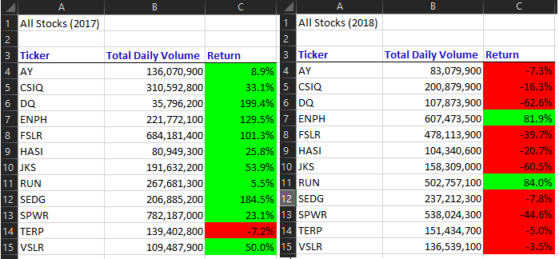
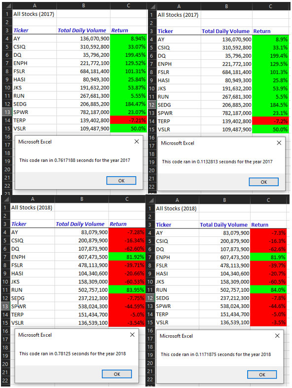

# An Analysis of Green Energy Stocks Using Two Versions of VBA Codes

## Overview of Project
This project uses a dataset containing several green energy stocks for the years 2017 and 2018. The dataset is in an excel sheet, and I was asked to help Steve make sense of the data so he can in turn help his parents make an educated decision on where to invest their money.

The dataset was presented to me in an excel sheet, as raw data. I needed to summarize the data using VBA macros, so that I can get a better comparison between stocks but also between 2017 and 2018.  
Two versions of the same task were tested in VBA to test performance. The task was about getting each stock's daily volume and return for each year while creating buttons for a better UX. The first code took longer than the second, refactored code to run. Since the first code had to loop more times across the rows in the first column to extract the daily volume and return, the refactored code used arrays and an index variable to loop over the rows once. Clearly, the second code was more efficient in performance. 
I would also like to add that the second code had formatting subroutine included in its run time, compared to the first set of code. The first one ran longer and did not include the time to format the result - even if the formatting run time is negligible, the refactored code performed better.

###### *Disclaimer: Please note I do not have an understanding of how stock market works other than looking at some main KPIs we calculated in this module.*

### Purpose
The purpose of this report is to help Steve educate his parents on other green energy stocks, other than DAQO (which is also included in this dataset), on whether or not they should diversify their investment portfolio. This analysis will provides yearly returns and volumes for each stocks, so that Steve can better guide his parents on their investment plan.

## Results
### Comparing 2017 and 2018 green stock performances
The figure below shows the performance of the 12 green stocks provided in the data set for 2017 and 2018.

Comparing results for all the green stocks in the dataset from 2017 and 2018, at a quick glance, we can see that there has been a lot less return on green energy stocks in 2018, except for ENPH and RUN, which still had a positive return in both years. We can also notice that there has been a significant increase in the daily volumes for ENPH and RUN ticker compared to the other ones.  

ENPH's daily volume increased 2.7 times in 2018 from the previous year, and still had a ~82% return on their stock. Daily increase in volume is perhaps associated with how the stock is getting more interest from traders - this could be a good sign to invest.  

RUN's daily volume increased by ~47% from 2017 to 2018, and had a better return in 2018 of ~84%. The stock only had a ~6% return in 2017, so seeing how much more the volume is as well as the return in 2018, I would advise Steve's parents to definitely get some shares of this stock.  

### Comparing code performances
The below shows the run time for both years and for both versions of codes/subroutines we tested throughout this module.

While the original code, we'll call it version 1, did not include the formatting subroutine time in the run time, we notice a huge difference in performance between version 1 and 2. This is mainly because in version 1, the code had to loop through all the rows multiple times looking for one ticker at a time and extracting the daily volume and the return.  

Version 2, refactored code, included the formatting of the cells in the run time, still performed much better than version 1 with a much lower run time. This is due to the use of arrays and an index variable. The code only goes over the rows in the dataset once, whilst extracting the daily volume and the return to store in the array we created. The version 2 of the code was refactored to help performance and a much sleeker code structure.  

Finally, I would suggest Steve to tell his parents that we could see a decrease in overall return in green stock energy from 2017 to 2018 and investing in DQ is not the way to go. I would advise to split Steve's parents' investment into ENPH and RUN, because both stocks had a positive return for both years (although our limitation here with this dataset is only those 12 green stocks for only years 2017 and 2018; we should look into a more green stock tickers over multiple years, because factors like economic climate will definitely affect those stocks).

